# DTKproject ⚡️ [](https://github.com/kusal-tharindu/Timetable-Management-System/blob/main/LICENSE)   
## Timetable-Management-System !

<h2 align="center">
  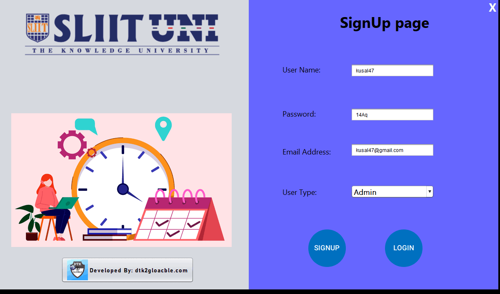
  <br>
</h2>

<a href="https://www.buymeacoffee.com/kusal26" target="_blank"><p style="text-align:center;"></a>

## Features
In this project I created Desktop application using Java. You can use this application to manage your timetable in a good way. You can develop this project as you wish under the MIT license.

⚡️ The application has three types of users.
- Student
- Lecturer
- Admin

⚡️ Connect directly with the mysql database.\
⚡️ Real time data update to application.\
⚡️ The database contains 7 data tables.
- assessments
- exam_details
- issue_time
- lecturers
- location
- subjects
- userdetails

⚡️ All data table operations with DML. (Data Manipulation Language)
- Data INSERT 
- Data UPDATE 
- Data  DELETE

⚡️ User login authentication with real database data.\
⚡️ Automatically identify the login user and their corresponding tasks.\
⚡️ Better real-time data analysis with pie chart and tables\
⚡️ And many more features...

---
## Getting Started 🚀 

These instructions will get you a copy of the project up and running on your local machine for development and testing purposes. Follow the below steps for that.


### 1. Prerequisites 📋

You'll need [NetBeans](https://netbeans.apache.org/download/index.html) and [phpMyAdmin](https://docs.phpmyadmin.net/en/latest/setup.html#quick-install) installed on your computer.

I am demonstrating this demo using `windows` operating system. If you are using other OS please use relevet Prerequisites program version.

 ### 2. Download 👇

 - [NetBeans](https://netbeans.apache.org/download/index.html)  
 - [phpMyAdmin](https://docs.phpmyadmin.net/en/latest/setup.html#quick-install)

### 3. how to run phpMyAdmin for windows ? 🤷‍♀️

The easiest way to get phpMyAdmin on Windows is using third party products which include phpMyAdmin together with a database and web server such as [XAMPP](https://www.apachefriends.org/index.html). 

- After installing it, you need to start `Apache` and `MySql`. 
- Then click ***Admin*** button under MySql section.

<h2 align="center">
  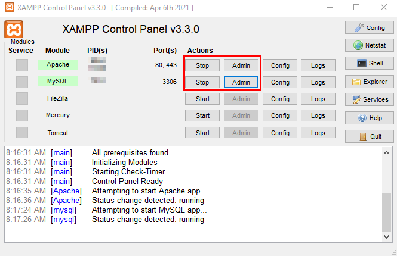
  <br>
</h2>

---

## How To Use 🔧

From your command line, first clone Timetable-Management-System:

### 1. Download code
- Method-01
```bash
# Clone the repository
$ git clone https://github.com/kusal-tharindu/Timetable-Management-System

```
- Method-02

Download directly from github.
<h2 align="center">
  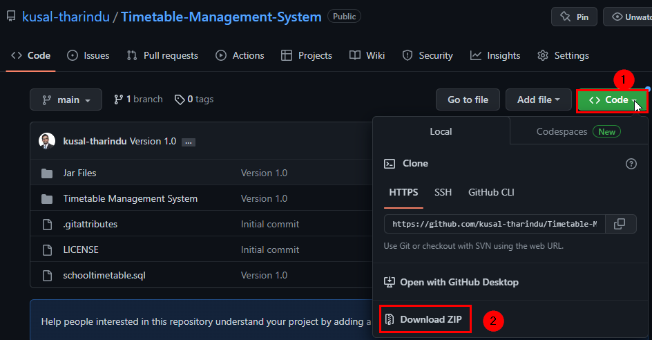
  <br>
</h2>
<!-- photo -->

### 2. Import the Sql source file into `phpMyAdmin`

- Go to the Import section and select the database file and import it. (downloaded Database file-name: ***schooltimetable***)

<span style= "color: #00c1ff"> For additional study ( This java code already have in the project file )</span>

`````java
// Database connection code
	
public class DBConnection {
    
    public static void main(String args[]) {
        getConnection();
    }

   
    static Connection con = null;
    
    public static Connection getConnection(){
        try {
            Class.forName("com.mysql.jdbc.Driver");
            con = DriverManager.getConnection("jdbc:mysql://localhost:3306/schooltimetable","root","");
            System.out.println("DataBase connected");
        } catch (Exception e) {
            e.printStackTrace();
            System.out.println("DataBase Disconnected");
        }
        return con;
    }  
}
`````

<h2 align="center">
  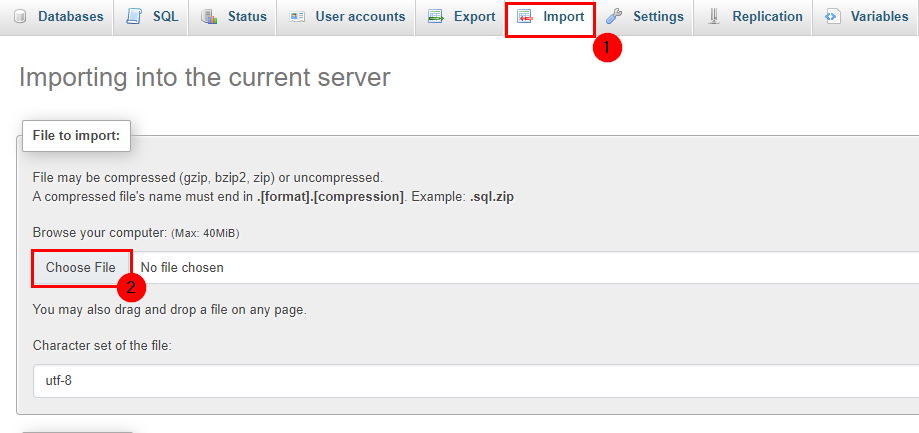
  <br>
</h2>


### 3. Open nbproject via NetBeans
- Open the netbeans application and open the netBeans project under the files section.
- After that go to relevet downloaded extract-file and select it.
- Then run the project. (Click the green triangle icon for that)

<h2 align="center">
  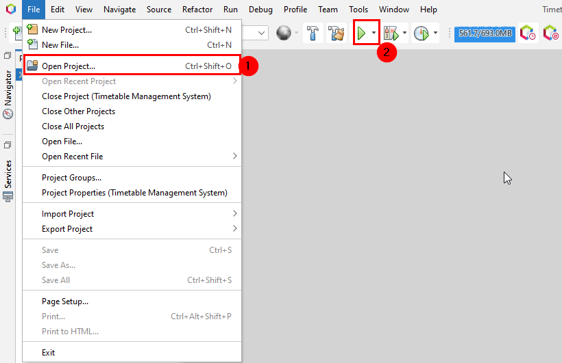
  <br>
</h2>

---

## How to work with Application?

Run the project. (Click the green triangle icon for that)

###  <span style= "color: #00c1ff">**(1) Signup Jframe** </span>


- Provide details of username, password( With numbers, uppercase and lowercase ), email and user type.
- Then click on the signup button.

<h2 align="center">
  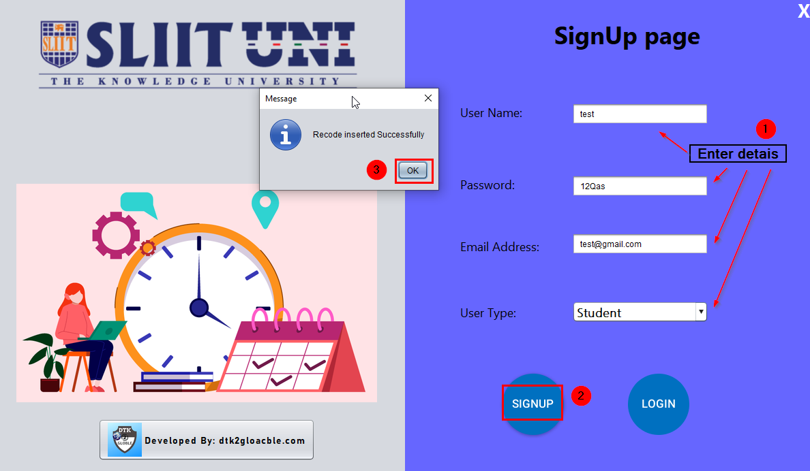
  <br>
</h2>

- Real time update data tables in database.

<h2 align="center">
  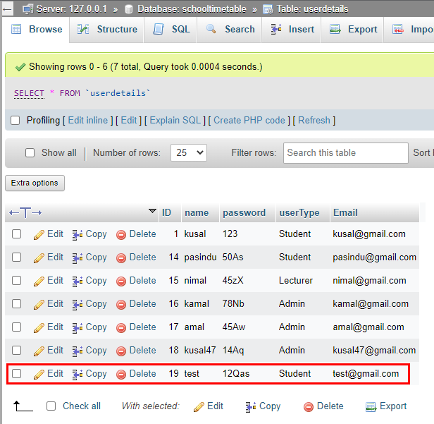
  <br>
</h2>

###  <span style= "color: #00c1ff">**(2) Login Jframe** </span>

- Fill the relevant information in the black.

<h2 align="center">
  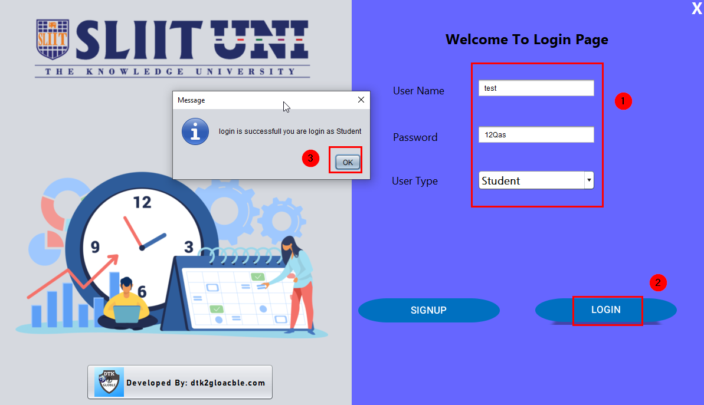
  <br>
</h2>

###  <span style= "color: #00c1ff">**(3) Dashboard Jframe** </span>

The dashboard you get will vary depending on the user type you provide when you sign up. Accordingly there are three types of dashboard.
- Student Dashboard
- Lecturer Dashboard
- Admin Dashboard

<h2 align="center">
  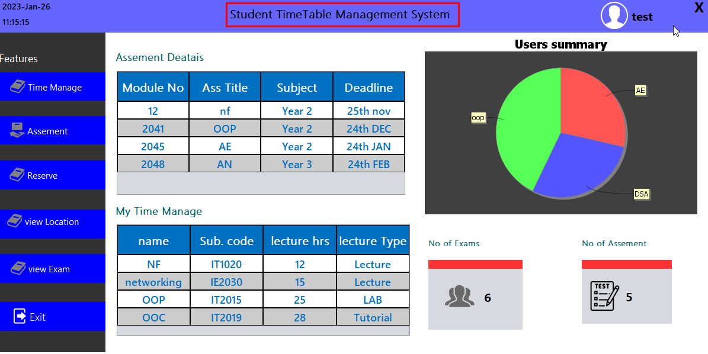
  <br>
</h2>

###  <span style= "color: #00c1ff">**(4) Admin Lecture Hall Jframe** </span>

- If you are registered as an administrator you can add, update and delete lecture halls.
- Also, you can see here all the lecture halls currently included in the system.

<h2 align="center">
  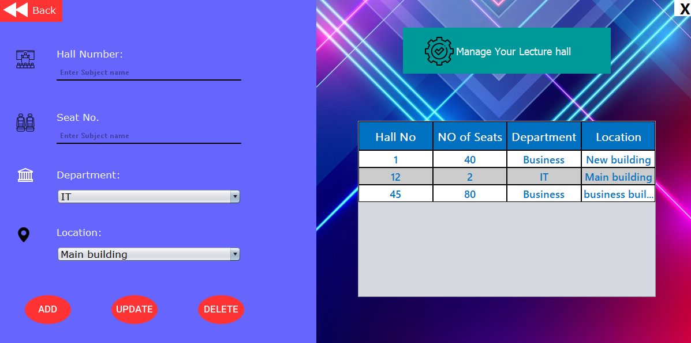
  <br>
</h2>


###  <span style= "color: #00c1ff">**(5) Admin user add Jframe** </span>

- If you are registered as an administrator you can add, update and delete Users.

<h2 align="center"> 
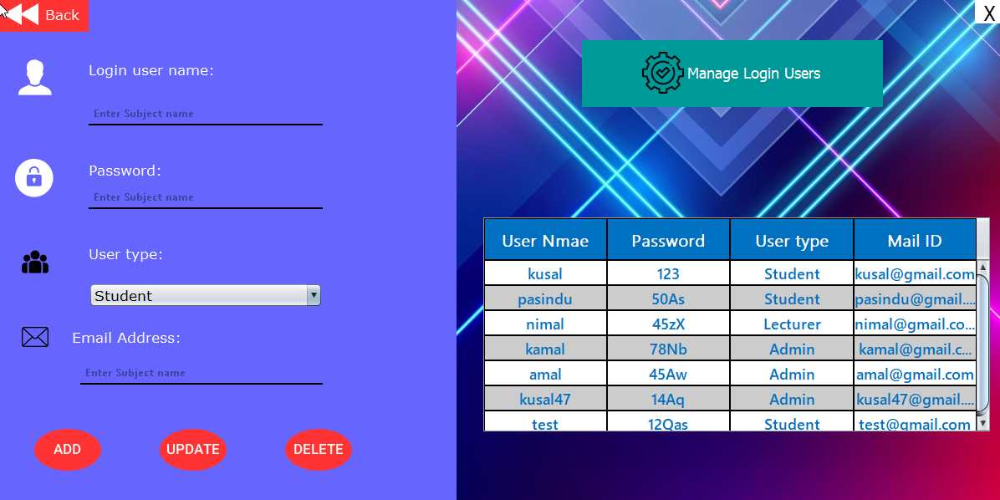
  <br>
</h2>

###  <span style= "color: #00c1ff">**(6) Issuses Jframe** </span>

- You can book the seat through this jframe.

<h2 align="center">
  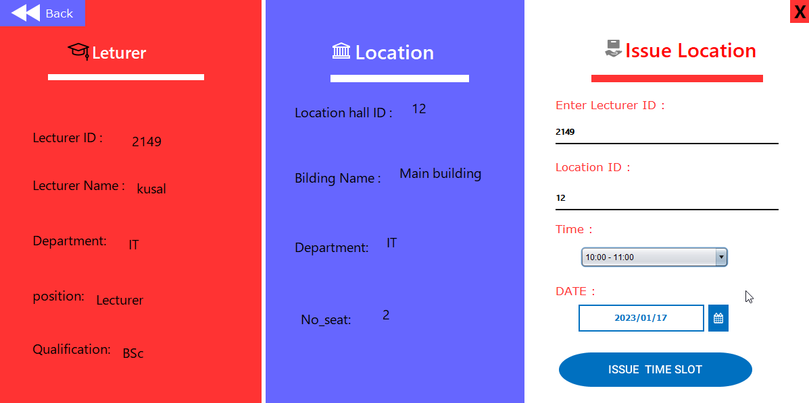
  <br>
</h2>

###  <span style= "color: #00c1ff">**(8) Location Search Jframe** </span>

-Here, you can search the location.

<h2 align="center">
  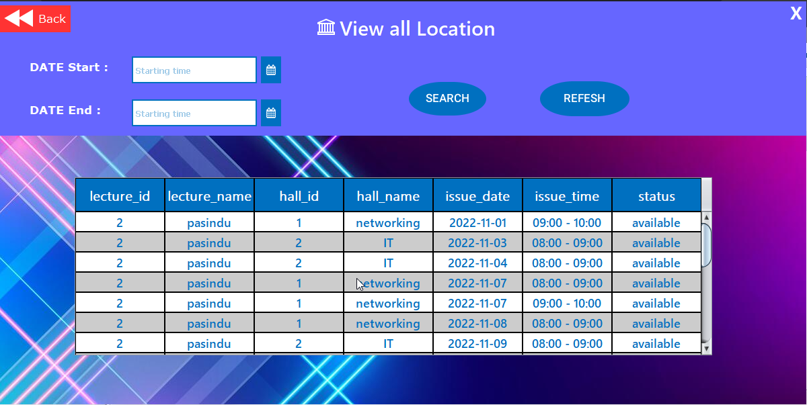
  <br>
</h2>

###  <span style= "color: #00c1ff">**(8) Subject add Jframe** </span>

- Here, You can add, update and delete Users.

<h2 align="center">
  
  <br>
</h2>

---
## Authors ✍

- **`Kusal Tharindu`**
- &nbsp; [- **Kusal Tharindu**]([https://github.com/sasinduKKarunarathna](https://github.com/kusal-tharindu)) 

- [](https://linkedin.com/in/kusal-tharindu) [](https://twitter.com/tharindu_kusal) [](https://github.com/kusal-tharindu)

## Wanna read my articles?

* &nbsp; [Portfolio](https://kusal.dtk2globle.com/)
* &nbsp; [Personal Blog](https://www.dtk2globle.com/)

## Contributors 🤝

- &nbsp; [Sasindu K Karunarathna](https://github.com/sasinduKKarunarathna)
- &nbsp; [Sasindu K Karunarathna](https://github.com/MalithaAbey)
- &nbsp; [Sasindu K Karunarathna](https://github.com/IMKDilshan)

---

## License 📄

This project is licensed under the MIT License.

Find out more details: [LICENSE.md](https://github.com/kusal-tharindu/Timetable-Management-System/blob/main/LICENSE)

---
## Fair Use Act Disclaimer 🛑 

This project is for educational purposes only.

Fair Use
Copyright Disclaimer under section 107 of the Copyright Act of 1976, allowance is made for “fair use” for purposes such as criticism, comment, news reporting, teaching, scholarship, education and research. Fair use is a use permitted by copyright statute that might otherwise be infringing.

Find out more details: [Disclaimer.md](https://github.com/kusal-tharindu/Timetable-Management-System/blob/main/Disclaimer.md)

---
## Acknowledgments 🎁

I was motivated to create this project because I wanted to contribute on something useful for the dev community.

Many thanks to all my contributors who helped make this project a reality.

---
## You can help me by Donating 💰

  <a href="https://www.buymeacoffee.com/kusal26" target="_blank"></a>
   
---
## Contact Me 📞
If you have any questions about this Privacy Policy, You can contact us:
- By email: contact@dtk2globle.com
